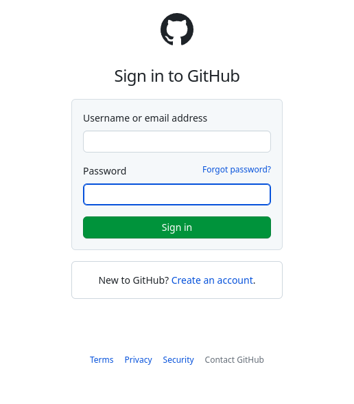
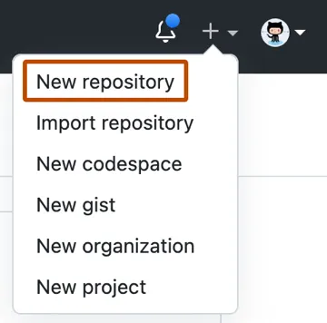

# Capacitação Git e Github

## O que é o Git?

Git é um sistema de controle de versões. O Git é utilizado, principalmente, para o trabalho em equipe. Através do Git, é possível notificar modificações feitas em um projeto para a equipe toda, comparar essas modificações e selecionar versões de um projeto conforme o mesmo é atualizado. Todas as versões e alterações ficam armazenadas. Versões idênticas não são salvas mais de uma vez, o que garante uma organização melhor do projeto. Sendo assim, que é armazenado no Git são os estados de um arquivo.
O criador do Git é Linus Torvalds, o mesmo criador do Linux.  

## O que é o Github?

## Configurando Acessos

### Token

### SSH

## Primeiro Respositório

### Via Github App

### Via Github Web

Para criar um repositório no Github:

1. Entre em sua conta na plataforma;

    

2. No canto superior direito, busque o ícone de "+" e selecione "Novo repositório";

    

3. Digite um nome de repositório e se desejar pode adicionar uma breve descrição no campo "Descrição";

    

4. Escolha se deseja que seu repositório seja público ou privado, se quer inicializar o projeto com um README.MD e clique em "Criar Repositório".

### Via Terminal

## Comandos Básicos

## Maneiras de contribuir com o Open Source

## Referências

- [Getting Started Installing Git](https://git-scm.com/book/en/v2/Getting-Started-Installing-Git)
- [Uma breve história do Git](https://git-scm.com/book/pt-br/v2/Come%C3%A7ando-Uma-Breve-Hist%C3%B3ria-do-Git)
- [Criar um repositório](https://docs.github.com/pt/get-started/quickstart/create-a-repo)
